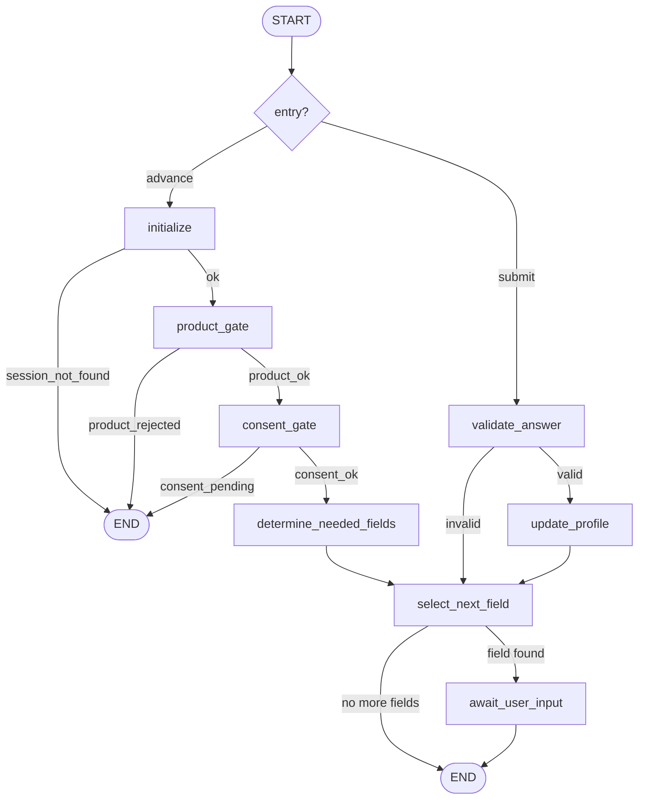

# Issue #5 — Product-Aware Consent Intake Agent

**Status:** ✅ Implemented & verified (238 tests pass; Issues #1–#4 still green; hermetic)
**Depends on:** [Issue #1](./issue-01-foundation.md), [Issue #2](./issue-02-insurance-schema.md), [Issue #3](./issue-03-market-registry.md), [Issue #4](./issue-04-rate-source-deduplication.md)

---

## 1. What was built

A **reusable, consent-aware, progressive intake system** — the interface future
Browser (#7) and Voice (#9) agents will call. It:

1. identifies/selects the insurance product (product gate),
2. collects only what is currently needed (starter vs just-in-time),
3. never re-asks a known material fact (canonical profile = source of truth),
4. validates answers through the canonical Pydantic schema,
5. progressively enriches one canonical `InsuranceProfile`,
6. supports new field requests discovered later (browser/voice/broker),
7. obtains explicit consent before sharing data with a route,
8. keeps sensitive data out of prompts/traces/logs,
9. lets fields/questions change via DATA (field catalog), and
10. creates human checkpoints for identity/consent/declaration boundaries.

This issue is **not** the browser agent or voice agent. It is deterministic — no
LLM is required for any intake decision.

## 2. What progressive intake means

The applicant answers one field at a time. After each validated answer the
canonical profile in the vault is updated, the next genuinely-missing field is
selected, and the journey continues. The draft profile can exist incomplete
(`is_draft`) and only becomes `is_live_quote_ready` when every
`required_for_live_quote()` path is populated.

## 3. Initial vs just-in-time intake

Two concepts are kept separate (issue section 14):

- **starter** (`intake_phase=starter`): useful core info to begin shopping —
  legal name, postal code, primary driver licence identity, primary vehicle
  identity. Auto-asked in `priority` order.
- **route_specific / sensitive_late**: collected **just-in-time** when an agent
  requests the exact canonical path (`request_fields`), never up front.

Starter completion ≠ live-quote ready. They are different statuses:
`starter_complete` vs `complete` (only when no live-quote field is missing).

## 4. Why the canonical profile is the source of truth

`InsuranceProfile` (Issue #2/#3) is the single authoritative store of answers.
"Ask once" is implemented by checking the profile, not session flags:
`is_missing(profile, path)` decides whether a field still needs asking. When
TD asks annual kilometres and Aviva asks the same later, the second request
returns `already_known=True` — no re-ask.

## 5. Field catalog architecture

`IntakeFieldDefinition` (data-driven, `data/intake/auto_fields.json`):

```
field_id, product_type, canonical_path_template, question, short_label,
input_type, sensitivity, collection_group, intake_phase, priority, help_text,
choices, enabled, item_unit, item_index_placeholder, item_unit_required,
household_attestation_required, seed_required
```

The catalog is loaded/validated by `IntakeFieldCatalog`, which also resolves
`{vehicle_index}` → `0` (single-item intake in Issue #5) and reverse-maps a
concrete canonical path back to a definition (`by_path`).

## 6. Question metadata vs Pydantic validation

- **HOW TO ASK** lives in the catalog: question text, label, input type,
  choices, sensitivity classification, phase, priority.
- **HOW TO VALIDATE** stays in the Pydantic schema. The engine uses
  `profile.updated(path, value)` which re-validates the whole profile. The
  catalog's `input_type` is only an early deterministic guard (e.g. integer
  fields must be whole numbers) plus the gate for list-item unit fields.

The catalog never duplicates validation rules.

## 7. Canonical field paths

Reuses the Issue #3 convention exactly (`paths.py`):

```
applicant.identity.date_of_birth
product_data.drivers[0].licence.licence_number
product_data.vehicles[0].use.annual_kilometres
product_data.coverage.third_party_liability.selected_limit
applicant.address.years_at_current_address   (new optional field, Issue #5)
```

Catalog templates may carry a placeholder (`{vehicle_index}`) that the catalog
resolves to a concrete canonical path before asking/updating. No second path
syntax exists.

## 8. Dynamic field discovery

`IntakeEngine.request_fields(session_id, requested_paths, source_context)`
answers per path: `already_known | missing(requested) | unsupported_path |
consent_required | human_checkpoint_required`. A path with no catalog
definition returns `unsupported` with a safe reason — never a guess, never a
crash. The newly-discovered question demo
(`applicant.address.years_at_current_address`) is a single optional schema
field + one catalog record + tests — proven by a test that asserts the string
`years_at_current_address` does **not** appear anywhere in `engine.py`.

## 9. How "ask once" works

- Session tracks `requested_fields` / `completed_fields` / `declined_fields`.
- `_pick_next_field` computes candidates = unit blockers ∪ requested-missing ∪
  starter-missing (all must be missing **in the profile**) and picks the lowest
  `priority`. Disabled fields are never candidates.
- Once a path is populated in the vault profile it is never re-asked, even by a
  different route/agent.

## 10. Intake session state

`IntakeSession` (safe metadata only — **no raw answers**):

```
session_id, profile_id, insurance_type, status, current_field_id,
current_canonical_path, requested_fields[], completed_fields[],
declined_fields[], invalid_retries{}, validation_retry_count, created_at, updated_at
```

`status`: `new | active | collecting | consent_pending | product_rejected |
starter_complete | complete | deleted`. `FieldRequestState` tracks a single
field: `unknown | requested | answered | declined | invalid_pending_retry |
unsupported`.

## 11. LangGraph flow

`graph/intake_workflow.py` — `IntakeWorkflowState` carries **safe metadata
only** (session/profile ids, field ids, paths, counts, consent scope, status,
`last_error`). Two entry paths converge on a shared tail:



**How it works**

- **advance path** (`GET /next-question`): `initialize → product_gate →
  consent_gate → determine_needed_fields → select_next_field →
  await_user_input`. Each conditional edge short-circuits to `END` on
  `session_not_found`, `product_rejected`, or `consent_pending` — an
  unsupported product never reaches a question.
- **submit path** (`POST /answers`): `validate_answer` runs a dry-run
  validation; if valid it flows to `update_profile` (which persists via the
  vault) and then the shared tail picks the next question; if invalid it flows
  straight to `select_next_field` to re-ask the same field (retry).
- **Privacy**: raw answers travel through a `contextvars` "pending answer"
  inbox set by the API and consumed by the validate/update nodes. They **never
  appear in trace-visible graph state** — LangSmith captures only safe
  metadata.
- Each node calls `set_stage(...)` so it is individually traceable and
  correlated with the run's `request_id`/trace id.

## 12. Validated updates

Plain scalar fields update via `InsuranceProfile.updated(path, value)`
(revalidates the whole profile; rejects unknown paths/indexes). Typed list
items (driver/vehicle identity) cannot exist partially in the canonical schema,
so the engine accumulates the unit's required fields into an in-memory pending
buffer and materializes the item once complete via `updated(container_path,
[...existing, item])`. This is catalog-driven (`item_unit`,
`item_unit_required`) — there is no per-field or per-insurer branch.

## 13. Invalid-answer retry

A bad value (e.g. `annual_kilometres = -500`) is rejected by Pydantic:
`SubmitAnswerResult(validation_success=False, error_message=path-only,
retry_eligible=True)`. The previous valid profile stays untouched in the vault
(the bad value is never written). Retry count increments and the same field is
asked again.

## 14. Product routing

`InsuranceType.AUTO` → supported intake. `HOME/TENANT/LIFE/TRAVEL/OTHER` →
`ProductGateResult(status="product_not_implemented", is_supported=false)` and a
`product_rejected` session that never asks AUTO fields. Adding `HomeInsuranceProfile`
later is localized (new product profile + catalog file + product gate mapping).

## 15. Consent types

- `ConsentScope.COLLECTION` — recorded at session creation (the applicant
  requested this journey); lets the consent gate pass.
- `ConsentScope.ROUTE_DISCLOSURE` — explicit per-route consent, recorded once
  per session+route (no repeated asks in the same decision context).
- `ConsentScope.HOUSEHOLD_DRIVER` — applicant attestation that another
  household driver consented.

Receipts (`ConsentReceipt`) store **paths and metadata, never values**, and are
kept separate from quote data.

## 16. Route-specific disclosure

`create_route_disclosure(session_id, registry_id, paths?)` builds a
`RouteDataDisclosure`: items are `{canonical_path, label, sensitivity}`
(populated fields only), plus `sensitive_items` (paths classified sensitive).
The applicant can then APPROVE or EXCLUDE. Nothing is submitted — this is the
reusable primitive for Issue #6/#7.

## 17. Household-driver consent

Catalog fields with `household_attestation_required=True` (e.g.
`other_driver_name`) cannot be requested or answered until a
`HOUSEHOLD_DRIVER` receipt exists — the engine returns
`consent_required`/`human_checkpoint_required` with `checkpoint_kind =
consent_attestation`. Consent is obtained **before** collection, never after.

## 18. Human checkpoints

`HumanCheckpointKind`: `identity_lookup | consent_attestation |
application_declaration | signature | payment | purchase | policy_binding |
renewal | cancellation`. `CheckpointService.evaluate(kind)` returns a
`CheckpointRequirement` with `requires_explicit_human_checkpoint` and, for
signature/payment/purchase/binding/renewal/cancellation,
`must_not_automate=True`. No browser action happens here; no quote terminal
statuses are defined.

## 19. Profile vault

`ProfileVault` is a `typing.Protocol` (`create/get/update/delete/exists`) so a
PostgreSQL or other backend can replace it without touching `IntakeEngine`.
Two implementations:

- `InMemoryProfileVault` — ephemeral dict (dev/tests default).
- `EncryptedFileProfileVault` — Fernet (`cryptography`), one `<id>.enc` file
  per profile, key **only from env** (`INTAKE_VAULT_KEY`), data dir gitignored,
  plaintext PII never written to disk. A test proves the synthetic
  licence/VIN/DOB/postal strings are absent from the persisted file.

`build_profile_vault()` picks encrypted when a key is configured, else
in-memory.

## 20. Why PII is excluded from graph/traces/prompts

- The graph carries identifiers only; raw answers never enter state (pending
  inbox instead).
- `run_config` metadata is safe (session id, insurance type, field id, path,
  sensitivity *classification*, counts).
- Structured logs emit safe fields; `RedactingContextFilter` redacts message
  text; `SensitiveBaseModel.__repr__/redacted_dict` are redacted.
- Consent receipts and profile summaries contain presence/paths, never values.
- Privacy tests assert synthetic DOB/VIN/licence/address never appear in graph
  state, logs, receipts, summary, session dumps, or exception strings.

## 21. Optional/limited LLM use

**No LLM is used in Issue #5.** The system is fully deterministic
(schema + catalog + paths + redaction + receipts). A future safe adapter could
handle non-sensitive product intent or question rewording, but sensitive
answers must never enter prompts. Prefer deterministic structured inputs for
sensitive fields.

## 22. How the Browser Agent (#7) will call Issue #5

A discovered missing field → `request_fields(profile_id→session,
["product_data.vehicles[0].use.annual_kilometres"], "browser")` →
`requested` → `next-question` surfaces it → applicant answers →
validated update → browser resumes. Re-requests return `already_known`.

## 23. How the Voice Agent (#9) will call Issue #5

Identical interface. A broker question maps to a canonical path →
`request_fields(..., "voice")` → same ask/validate/update flow →
voice conversation resumes. Source context distinguishes the caller.

## 24. Dynamic field changes (Scenarios A–G)

- **A** question text change → data only, behavior unchanged.
- **B** new route-specific field pointing to an existing optional field
  (`applicant.identity.gender`) → asked/updated with no workflow change.
- **C** `enabled=false` → field disappears from starter questions.
- **D** priority change → question order changes from data.
- **E** catalog definition added for an already-populated field → not re-asked.
- **F** unknown future path → structured `unsupported`.
- **G** `years_at_current_address` → one optional schema field + one catalog
  record + validation/tests; proven free of any engine special-case.

## 25. Alternatives & tradeoffs

- **LangGraph for every HTTP call vs meaningful nodes only:** the graph handles
  orchestration transitions; single-step deterministic ops (e.g. consent,
  disclosure) stay in the engine. This keeps tracing meaningful without
  artificial nodes.
- **Pending-inbox vs raw values in state:** passing answers through a contextvar
  keeps them out of LangSmith-captured state, at the cost of a small, explicit
  plumbing pattern.
- **In-memory + encrypted-file vault vs a real DB:** Issue #5 deliberately does
  not build a database; the `ProfileVault` Protocol is the seam for later.
- **Item-unit assembly vs per-field setters:** unit assembly is generic and
  catalog-driven but adds the concept of pending typed objects.
- **Collection consent auto-recorded at session start:** pragmatic; route
  disclosure consent remains explicit and per-route.

## 26. Testing / debugging

- 9 new test files + `intake_helpers.py`; all hermetic (tmp catalogs, synthetic
  data, no network/LangSmith/LLM).
- Debug: `get_next_question` returns `None` → check the field is disabled,
  declined, already populated, or gated by household attestation.
- `ProfileUpdateError` message is path-only by design — never log the raw value.

## 27. Common mistakes

- Re-asking a known field → check `is_missing(profile, path)`, not session flags.
- Putting raw answers in graph state → use the pending-answer inbox.
- Hardcoding a field in the engine → put it in the catalog (Scenario G test
  guards against this).
- Treating `starter_complete` as `complete` → they are different statuses.
- Assuming disabled fields are collectable → they are never candidates.

## 28. 30-second interview explanation

> "Issue #5 is the consent-aware progressive intake engine. One canonical
> profile in a vault is the source of truth. A data-driven field catalog says
> how to ask each question; the Pydantic schema says how to validate it. The
> engine asks only genuinely-missing fields, in priority order, and never
> re-asks something already known — even when a different insurer or agent
> requests it. External agents call `request_fields` to ask for a missing
> canonical path just-in-time. Consent is structured into collection,
> route-disclosure, and household-driver receipts that store paths, never
> values. The LangGraph flow carries only safe metadata; raw answers never
> enter traces. All of it is deterministic — no LLM needed."

## 29. 2-minute interview explanation

Adds: product gate (AUTO supported, others rejected), starter vs
route-specific intake, the profile vault (in-memory or Fernet-encrypted at
rest, key from env only), list-item unit assembly for driver/vehicle identity,
route data-sharing previews, human checkpoint controls for
signature/payment/purchase, and the dynamic-change guarantee — question text,
order, enabled state, and new fields change via JSON, not code.

## 30. Deep technical explanation

Walk the code: `IntakeEngine.create_session` → product gate + collection
consent receipt; `get_next_question` → `_pick_next_field` (unit blockers ∪
requested ∪ starter, priority order, profile-backed missing checks);
`submit_answer` → seed bootstrap or `profile.updated()` (scalar) or unit
pending → assembly → `updated(container, [...])`; `request_fields` →
already_known / requested / unsupported / consent_required. Graph nodes:
`initialize/product_gate/consent_gate/determine_needed_fields/select_next_field/
await_user_input` (advance) and `validate_answer/update_profile` (submit, via
the pending-answer inbox). Tracing via `run_config` with safe metadata;
structured logging with `RedactingContextFilter`; privacy enforced by the vault
boundary, schema-level `SENSITIVE_FIELD_NAMES`, and the graph's metadata-only
state.

## 31. Self-test questions (with answers)

1. Q: What is the single source of truth for "do I need to ask this field?"
   A: The canonical `InsuranceProfile` in the vault (`is_missing`), not session flags.
2. Q: Where does HOW TO ASK live vs HOW TO VALIDATE?
   A: Field catalog vs Pydantic schema (`profile.updated`).
3. Q: How does "ask once" work across routes?
   A: The profile keeps the value; `request_fields` returns `already_known`.
4. Q: What are the three consent scopes?
   A: collection, route_disclosure, household_driver.
5. Q: Where are raw answers stored?
   A: Only in the profile vault (and transient pending buffers) — never session/traces.
6. Q: What does a disabled field do?
   A: It is never a candidate for a question.
7. Q: What happens with an invalid answer?
   A: Path-only error, retry_eligible, previous profile intact.
8. Q: How are driver/vehicle identities built?
   A: Catalog `item_unit` fields accumulate in a pending buffer, then a typed item is materialized and appended via `updated(container, [...])`.
9. Q: What statuses are NOT the same?
   A: starter_complete vs complete (live-quote ready) vs product_rejected.
10. Q: How does an external agent request a new field?
    A: `request_fields(paths, source_context)`; missing → requested → asked once.
11. Q: What is returned for an unknown path?
    A: `unsupported` with a safe reason — never a guess.
12. Q: Why is the pending-answer inbox needed?
    A: To keep raw values out of trace-visible LangGraph state.
13. Q: When must other-driver data not be collected?
    A: Until a household_driver attestation receipt exists.
14. Q: Which checkpoint kinds are `must_not_automate`?
    A: signature, payment, purchase, policy_binding, renewal, cancellation.
15. Q: Where does the encryption key come from?
    A: `INTAKE_VAULT_KEY` env only; never committed.
16. Q: How is `years_at_current_address` supported?
    A: One optional schema field + one catalog record + validation/tests; no engine special-case.
17. Q: What is `seed_required`?
    A: Fields the canonical schema requires before a profile can even be created (legal_name, postal_code).
18. Q: Is any LLM used in Issue #5?
    A: No — fully deterministic.
19. Q: How does the graph short-circuit a rejected product?
    A: `product_gate` sets product_rejected and a conditional edge routes to END.
20. Q: What does `ProfileSummary` contain?
    A: Presence flags + counts + sensitivity/phase, never values.
21. Q: Can one profile overwrite another?
    A: No — separate profile_ids; vault.update requires the id to exist.
22. Q: How is starter vs just-in-time expressed?
    A: `intake_phase` in the catalog (starter | route_specific | sensitive_late).

## 32. Rebuild exercise

1. `IntakeFieldDefinition` + enums + `IntakeFieldCatalog` (load, resolve, by_path).
2. `ProfileVault` Protocol + in-memory + encrypted-file (Fernet) implementations.
3. `ConsentService` + `ConsentReceipt`/`ConsentScope`/`RouteDataDisclosure`.
4. `IntakeSession` + `InMemorySessionStore`.
5. `IntakeEngine`: product gate, seed bootstrap, `_pick_next_field`,
   `submit_answer`, `request_fields`, summaries, disclosures, checkpoints.
6. `IntakeWorkflowState` + LangGraph advance/submit flows with conditional edges.
7. `api/intake.py` + `main.py` wiring.
8. `data/intake/auto_fields.json` catalog.
9. Tests: product routing, progressive intake, consent, vault, privacy,
   checkpoints, dynamic scenarios A–G, workflow, API.

## 33. Cheat sheet

```python
from app.services.intake import get_intake_engine
e = get_intake_engine()
session, gate = e.create_session(InsuranceType.AUTO)          # product gate
_, question = e.get_next_question(session.session_id)        # next missing field
r = e.submit_answer(session.session_id, path, value)         # validated update
out = e.request_fields(sid, [path], "browser")               # already_known/requested/unsupported
disc = e.create_route_disclosure(sid, "td-insurance")        # paths, not values
dec = e.grant_route_consent(sid, "td-insurance", paths, True)  # or False = exclude
e.record_household_driver_consent(sid, "driver_1")           # attestation
summary = e.get_safe_profile_summary(sid)                    # presence only
e.delete_session(sid)
```

Key names: `IntakeEngine`, `IntakeFieldCatalog`, `IntakeFieldDefinition`,
`ProfileVault`, `InMemoryProfileVault`, `EncryptedFileProfileVault`,
`ConsentService`, `ConsentScope`, `ConsentReceipt`, `RouteDataDisclosure`,
`IntakeSession`, `IntakeSessionStatus`, `HumanCheckpointKind`,
`CheckpointService`, `IntakeWorkflowState`, `build_intake_workflow`,
`get_intake_engine`.

## 34. Reusable synthetic AUTO personas (fixtures)

Reusable test personas live in `tests/personas.py` (a flat module matching the
existing `tests/factories.py` pattern). They are built **from the real Pydantic
models** via the low-level factories, using a **base profile + small overrides**
architecture so changing an optional canonical field never requires rewriting
every fixture.

```python
from personas import (
    make_standard_auto_profile,
    make_progressive_auto_profile,
    make_edge_case_auto_profile,
)

standard   = make_standard_auto_profile()                 # live-quote ready
draft      = make_progressive_auto_profile()              # valid draft
edge       = make_edge_case_auto_profile()                # complexity
modified   = make_standard_auto_profile(annual_kilometres=None)   # override
by_path    = make_standard_auto_profile(**{"applicant.address.city": "Ottawa"})
```

Three personas:

- **STANDARD_COMPLETE** (`make_standard_auto_profile`) — one driver, one
  vehicle, normal history, standard coverage; `is_live_quote_ready is True`.
- **PROGRESSIVE_INCOMPLETE** (`make_progressive_auto_profile`) — a valid draft
  missing route-specific/optional fields: `annual_kilometres`,
  `years_at_current_address`, `tpl_selected_limit`, `one_way_commute_km`, and
  `date_of_birth`. Ideal for progressive/browser/voice intake tests.
- **EDGE_CASE** (`make_edge_case_auto_profile`) — legitimate complexity: an
  additional household driver (`other_drivers` + household member), a prior
  claim, a conviction, and an insurance interruption (cancellation +
  `years_continuously_insured = 0`).

Design rules:

- **Base + overrides**: each persona starts from a shared synthetic base and
  applies small keyword overrides through `InsuranceProfile.updated()` (the
  canonical validated path mechanism), so every override is schema-validated.
- **Friendly names + canonical paths**: common fields (`annual_kilometres`,
  `years_at_current_address`, `tpl_selected_limit`, ...) are friendly keyword
  args mapped via `FRIENDLY_FIELD_PATHS`; anything else can be overridden by
  passing a canonical path directly. Adding/removing an optional schema field
  needs only a friendly-map entry (or a path override), never a fixture rewrite.
- **Obviously synthetic**: `T0000-0000000-0000`, `1HGCM82633A000000`, `M0A 0A0`,
  `416-555-0199`, `test.applicant@example.com`, `123 Test Street`,
  `SYN-0000001`, and clearly-labelled synthetic claim/conviction text. Never a
  real person.
- **Privacy**: `redacted_dict()`/`repr`/`str` hide all sensitive values; tests
  assert the raw markers never appear in safe output (they only exist in raw
  `model_dump`), so the fixtures are safe for logs/traces.
- **Reuse**: the same personas feed Issue #5 (intake/validation/vault — a test
  stores one in `InMemoryProfileVault` and applies a validated update), and are
  ready for Issue #6 route planning, #7 browser autofill, #9 voice missing-field
  flows, #10 evidence, #11 normalization, and #12 comparison.

Tests: `tests/test_personas.py` (validate each persona, draft status, overrides,
privacy, vault reuse, friendly-path validity).

**Related:** [learning index](./README.md) · [Issue #1](./issue-01-foundation.md) · [Issue #2](./issue-02-insurance-schema.md) · [Issue #3](./issue-03-market-registry.md) · [Issue #4](./issue-04-rate-source-deduplication.md)
