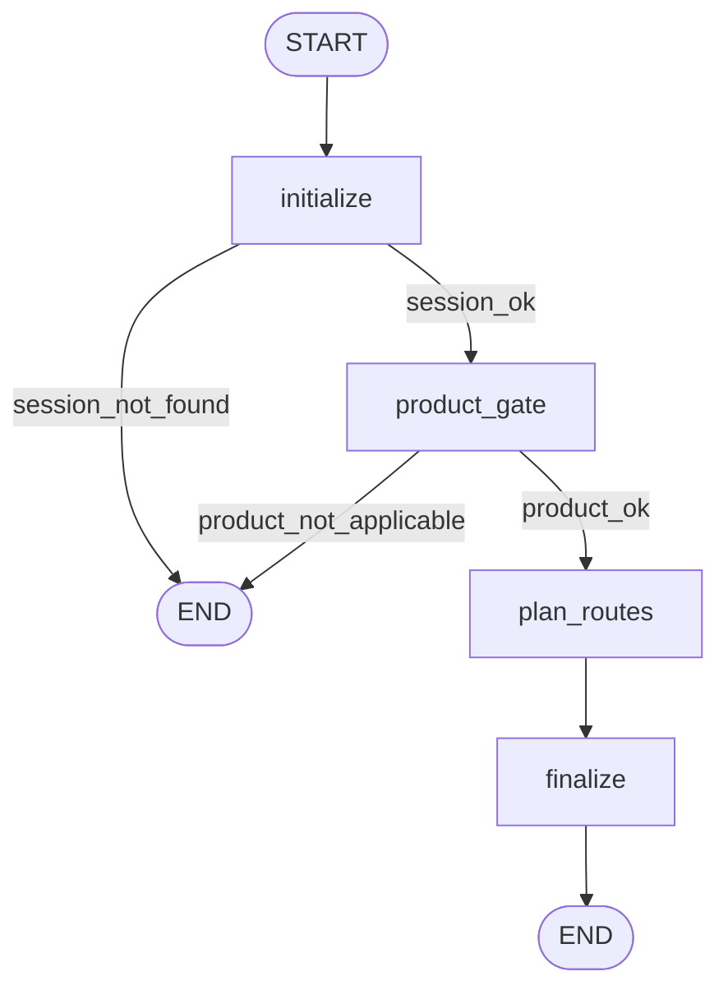

# Issue #6 — Core Route Planner (Parts 1 & 2)

**Status:** ✅ Implemented & verified — **306 tests pass** (incl. 16 hardening
tests in `test_route_planner_hardening.py` covering the 14 mandatory scenarios);
Issues #1–#5 still green; hermetic (no LangSmith/network/LLM in tests).
**Depends on:** [Issue #3](./issue-03-market-registry.md) (registry), [Issue #4](./issue-04-rate-source-deduplication.md) (dedup), [Issue #5](./issue-05-intake-agent.md) (intake/consent/vault)

---

## 0. Part 2 hardening — what changed

Issue #6 had two parts. Part 1 delivered the core deterministic planner (below).
Part 2 hardened the implementation and added a mandatory 14-scenario test
suite. The behavioural additions:

- **Confirmed duplicate groups now emit a primary + visible alternatives**
  (`PlannedRoute.is_alternative`, default `False`). Previously a confirmed
group collapsed to ONE route; now the representative is the primary
(`is_alternative=False`) and every other active member is emitted as an
alternative (`is_alternative=True`) sharing the same `distinct_rate_source_id`
and `deduplication_status` — nothing about a confirmed group is hidden.
- **Two new `RouteChannelKind` values**: `human` (route requires human
  interaction, from `MarketRequirement.HUMAN`) and `discovery_only` (fallback
  when a route has no direct quote channel — aggregator/discovery only).
- **Household-driver consent gate integration**: the planner now calls a new
  safe `field_gate(session_id, canonical_path)` on the profile source. When a
  missing required field would need a household driver's personal data without
  their consent (`field_gate == "household_consent_required"`), the route gets
  an additional `human_required` blocker with that canonical path.
- **`RoutePlanSummary.alternative_route_count`** added for coverage metrics.
- **Unknown requirement paths fail safely** (treated as missing; never crash),
  and unknown `MarketRequirement` enum members are ignored safely.
- Progressive missing-field resolution and ask-once semantics are proven
  end-to-end against the real `IntakeEngine` via `make_integration_env`
  (real engine + synthetic registry), plus data-driven merge/split and
dynamic requirement/channel scenarios.

See §14 for the 14-scenario map and §20 for expanded self-test questions.


---

## 1. What was built

A **deterministic, per-route, evidence-first planner** that turns the Ontario
AUTO market into a pre-flight route plan for one intake session:

- `models/route_planner.py` — `RoutePlan`, `PlannedRoute`, `RouteBlocker`,
  `RouteChannel`, `RoutePlanSummary`, `RoutePlanWorkflowState`.
- `services/route_planner/requirements.py` — data-driven `RequirementResolver`.
- `services/route_planner/planner.py` — `RoutePlanner` +
  `RoutePlannerProfileSource` Protocol + `IntakeProfileSource` adapter.
- `data/routes/auto_route_requirements.json` — data-driven per-route requirements.
- `graph/route_planner_workflow.py` — safe LangGraph orchestration.
- `api/planner.py` — read-only plan + missing-field request endpoints.

No LLM. No browser/voice execution (Issue #7+). No applicant values anywhere —
the plan carries **canonical field paths + public market data only**.

## 2. Critical rules honoured

1. **No global `is_live_quote_ready` requirement.** Readiness is computed per
   route from **that route's** required canonical paths.
2. **Readiness is per route** — a draft profile can have ready routes.
3. **A route can have multiple blockers simultaneously** (missing fields,
   consent, membership, unresolved rate source, …).
4. **Confirmed duplicates group** under one representative (`group_members`).
5. **Possible/unresolved duplicates are NOT suppressed** — they stay as their
   own visible routes with a `rate_source_unresolved` blocker.
6. **Requirements & market changes are data-driven** (`auto_route_requirements.json`).
7. **No insurer-specific if/elif** — only data + a deterministic
   `MarketRequirement`→path map.
8. **`RoutePlan` contains canonical paths, never values.**
9. **Reuses Issue #5 services** (engine presence/consent, vault, profiles) and
   the existing synthetic persona/factory test fixtures.
10. **No Issue #7+ functionality.**

## 3. Product-aware AUTO routing

`RoutePlanner.plan(session_id)` starts with the product gate: a non-AUTO
session returns an empty "not applicable" `RoutePlan`
(`insurance_type` set, `routes=[]`). Only AUTO registry entries (`product_type
== auto` and `active`) are planned.

## 4. Market registry + dedup integration

- Registry: `MarketRegistryService.list_markets()` filtered to AUTO + active.
- Dedup: `RateSourceDeduplicationService.deduplicated_registry_view()` provides
  the canonical collapse semantics:
  - confirmed duplicate group → a **primary** `PlannedRoute`
    (`deduplication_status=duplicate_confirmed`, `is_alternative=False`,
    `group_members` listing all underlying registry ids) **plus one visible
    `PlannedRoute` per active alternative member** (`is_alternative=True`),
    all sharing the same `distinct_rate_source_id` — a confirmed group is never
    hidden, only grouped;
  - possible/unresolved → each is its **own** visible route with
    `deduplication_status=unresolved` (never suppressed).
- Each route carries `distinct_rate_source_id` and `deduplication_status`.
- Honest real seed: every route is unresolved today (matches Issue #4's 0/0/31).

## 5. Requirement resolver (data-driven)

`RequirementResolver.requirements_for(entry)` = `default` paths ∪
`per_route[registry_id]` paths ∪ deterministic `MarketRequirement` enum map
(`LICENCE` → `product_data.drivers[0].licence.licence_number`, `VIN` →
`product_data.vehicles[0].identity.vin`). Adding/removing a requirement is a
DATA change (`auto_route_requirements.json`), never a code branch.

## 6. Per-route evaluation → blockers

For each route the planner checks (deterministically):

| Check | Blocker kind |
|---|---|
| required canonical path missing in profile | `missing_field` (one per path) |
| route-disclosure consent not granted | `consent_required` |
| registry `MarketRequirement.MEMBERSHIP` | `affinity_restricted` |
| registry `MarketRequirement.CALLBACK` | `callback_required` |
| registry `MarketRequirement.HUMAN` | `human_required` |
| `product_scope` not standard/unknown | `specialty_only` |
| no verified `distinct_rate_source_id` | `rate_source_unresolved` (visible) |

`is_ready = blockers is empty`; `route_status = "ready" | "blocked"`.

## 7. Issue #5 integration (missing fields + consent)

- The planner calls the engine only through a safe Protocol
  (`RoutePlannerProfileSource`): `field_presence` (presence booleans, never
  values), `has_route_consent`, `field_gate`, `check_supported`, `get_session`.
- `IntakeEngine` gained four additive, safe methods: `field_presence`,
  `has_route_consent`, `profile_exists`, and `field_gate` (read-only
  `"ok" | "household_consent_required"` — used for household-driver
  fields whose collection requires the household driver's own consent).
- When a missing required path is gated as `household_consent_required`, the
  planner adds a `human_required` blocker with that canonical path — the route
  needs the household driver's consent collected (Issue #5
  `record_household_driver_consent`) before it can be quoted.
- `RoutePlanner.request_missing_fields(session_id)` returns the union of
  missing required paths and calls the intake engine's `request_fields(...,
  "route_planner")` — the applicant is asked only for genuinely-missing fields
  (Issue #5 "ask once" preserved; proven for shared fields across two routes).

## 8. Route channels

`RouteChannel` derived from registry market data: `online` (quote_url),
`phone` (public_phone_route), `callback` (callback_route), `broker`
(licensed_intermediary), plus (Part 2) `human` (route requires human
interaction via `MarketRequirement.HUMAN`) and `discovery_only` (fallback when
a route has no direct quote channel — it is still shown, labelled as
discovery/aggregator only). Public market data, never applicant PII.

## 9. Deterministic ranking

Sort key: `(not is_ready, source unresolved, blocker_count, brand lower,
registry_id)`; `rank` = 1-based index. Ready routes first, verified-source
before unresolved, fewer blockers first, then alphabetical. No LLM, no risk
scoring (risk scoring is future work).

## 10. Safe LangGraph orchestration

`graph/route_planner_workflow.py` — `RoutePlanWorkflowState` carries safe
metadata only: `session_id`, `insurance_type`, counts
(`planned/ready/blocked_route_count`, `missing_field_path_count`),
`ready_registry_ids`, `workflow_stage/status`. Nodes:



`plan_routes` calls the deterministic planner and copies **only counts/ids**
into state — the full `RoutePlan` is returned by the service, never placed in
traced state.

## 11. Privacy

- The planner receives presence booleans only (via `field_presence`).
- `RoutePlan` contains canonical paths + public market data.
- Graph state/logs/traces: counts + registry ids only.
- Tests assert synthetic licence/VIN/DOB/address never appear in the plan,
  graph state, `repr`, or logs.

## 12. Data flow

```
IntakeSession (session_id)
  └─ RoutePlanner.plan(session_id)
       ├─ product gate (AUTO only)
       ├─ MarketRegistryService (AUTO + active)
       ├─ RateSourceDeduplicationService.deduplicated_registry_view()
       │     confirmed duplicates -> ONE PlannedRoute (group_members)
       │     possible/unresolved  -> SEPARATE visible routes (never suppressed)
       ├─ per route:
       │     RequirementResolver.requirements_for(entry) -> required paths
       │     field_presence -> missing-field blockers (multiple)
       │     has_route_consent -> consent_required
       │     MarketRequirement -> affinity/callback/human blockers
       │     product_scope -> specialty_only
       │     dedup status -> rate_source_unresolved (visible)
       │     channels from registry fields
       ├─ deterministic ranking
       └─ RoutePlan { routes, required_missing_paths, summary }
  └─ request_missing_fields -> engine.request_fields(..., "route_planner")
```

## 13. Files / symbols

| Concern | Location | Symbols |
|---|---|---|
| Models | `models/route_planner.py` | `RoutePlan`, `PlannedRoute`, `RouteBlocker`, `RouteBlockerKind`, `RouteChannel`, `RouteChannelKind`, `RoutePlanSummary`, `RoutePlanWorkflowState` |
| Requirements | `services/route_planner/requirements.py` | `RequirementResolver`, `MARKET_REQUIREMENT_PATHS` |
| Planner | `services/route_planner/planner.py` | `RoutePlanner`, `RoutePlannerProfileSource`, `IntakeProfileSource` |
| Data | `data/routes/auto_route_requirements.json` | default + per_route |
| Graph | `graph/route_planner_workflow.py` | `build_route_planner_workflow`, `WORKFLOW_NAME` |
| API | `api/planner.py` + `main.py` | `GET /planner/plan`, `POST /planner/plan/{id}/request-missing` |
| Engine additions | `services/intake/engine.py` | `field_presence`, `has_route_consent`, `profile_exists` |

## 14. Testing strategy

`tests/test_route_requirements.py`, `test_route_planner.py`,
`test_route_planner_workflow.py`, `test_route_planner_privacy.py`,
`test_planner_api.py`, and **`test_route_planner_hardening.py`** (Part 2, 16
tests) + `route_planner_helpers.py` (incl. `make_integration_env` which wires a
real `IntakeEngine` + synthetic catalog + synthetic registry, and
`complete_starter` for a draft profile). All hermetic (temp synthetic
registry/rate-source/requirements data; `StubProfileSource`; no
network/LangSmith/LLM).

Part 2 mandatory-scenario map:

| # | Scenario | Test(s) |
|---|---|---|
| 1 | Route-level completeness (postal vs vin) | `test_route_level_completeness_postal_vs_vin` |
| 2 | Multiple simultaneous blockers preserved | `test_multiple_blockers_vin_consent_membership_preserved` |
| 3 | Progressive missing-field resolution (real engine) | `test_progressive_missing_field_resolution` |
| 4 | Ask-once (shared field across two routes) | `test_ask_once_two_routes_reuse_same_field` |
| 5 | Confirmed duplicate primary + alternative | `test_duplicate_primary_and_alternative` |
| 6 | Possible/unresolved never suppressed | `test_possible_unresolved_never_suppressed_and_same_group_never_deduped` |
| 7 | Same group never auto-deduped | same as above |
| 8 | Dynamic market changes via data | `test_dynamic_market_changes_via_data` |
| 9 | Dynamic canonical field needs no planner code | `test_dynamic_canonical_field_needs_no_planner_code` |
| 10 | Dedup merge/split via data | `test_dedup_merge_then_split_via_data` |
| 11 | Consent granted/denied + household-driver gate | `test_route_consent_granted_denied`, `test_household_driver_consent_gate_integration` |
| 12 | All channel kinds (web/phone/callback/human/broker) | `test_channels_web_phone_callback_human_broker` |
| 13 | Unknown requirement / enum fails safely | `test_unknown_requirement_path_fails_safely`, `test_unknown_market_requirement_enum_ignored_safely` |
| 14 | Privacy (real profile → plan/state/logs) | `test_privacy_real_profile_plan_state_logs` |

Plus `test_coverage_metrics_summary` for the `RoutePlanSummary` counts.

## 15. Failure scenarios & debugging

| Scenario | Behavior |
|---|---|
| Non-AUTO session | empty "not applicable" plan |
| Unknown session | `SessionNotFoundError` → API 404 |
| Real seed (all unresolved) | every route visible with `rate_source_unresolved` (honest) |
| Route with no consent | `consent_required` blocker |
| Confirmed duplicate pair | one `PlannedRoute` + `group_members` |
| Possible/unresolved pair | two visible routes (not suppressed) |
| Missing per-route field | `missing_field` blocker with the canonical path |

## 16. Common misunderstandings

- Readiness is NOT global `is_live_quote_ready` — it's per route.
- `rate_source_unresolved` is a **visible** blocker, not a suppression.
- Confirmed duplicates collapse to a primary + visible alternatives; they are
  NOT hidden. Possible/unresolved do NOT collapse at all.
- Requirements are DATA (`auto_route_requirements.json`), not code.
- The plan holds paths + public market data, never applicant values.
- A missing household-driver field without their consent is a `human_required`
  blocker (via `field_gate`), not just a missing field.
- `discovery_only` is still a real, visible route — it means no direct quote
  channel, not "ignored".

## 17. 30-second interview explanation

> "Issue #6 is the deterministic route planner. For one intake session it turns
> the Ontario market into a pre-flight plan. It's product-aware (AUTO only),
> uses the registry plus Issue #4 dedup — confirmed duplicates group under one
> route while possible and unresolved duplicates stay visible. Readiness is per
> route, not global: each route has its own data-driven required canonical
> fields, and a route can have several blockers at once — missing fields,
> missing consent, affinity restrictions, unresolved rate sources. Everything
> is ranked deterministically, and the plan contains only canonical field paths
> and public market data — never applicant values. No LLM; it's fully
> deterministic."

## 18. 2-minute interview explanation

Adds: the `RequirementResolver` (default + per-route requirements in JSON plus
a deterministic `MarketRequirement`→path map), `RoutePlannerProfileSource` (the
planner only ever sees presence booleans via `field_presence`), the
`request_missing_fields` hook that feeds the union of missing paths back into
the Issue #5 intake engine so the applicant is asked once, route channels
(online/phone/callback/broker), and the safe LangGraph flow that carries only
counts and registry ids.

## 19. Deep technical explanation

`plan(session_id)` loads the session (product gate), builds an `{id → entry}`
map of AUTO+active registry entries, iterates
`dedup.deduplicated_registry_view()` (grouping confirmed duplicates), and for
each row calls `_plan_route`: resolve requirements, batch-presence check,
consent check, registry `MarketRequirement` blockers, product-scope blocker,
and unresolved-source blocker; then `_rank` sorts and assigns 1-based ranks;
the summary counts confirmed groups / unresolved / possible duplicates (via
`dedup.find_duplicate_candidates` reason codes). `request_missing_fields`
delegates to `engine.request_fields`. The LangGraph wraps this with safe state.

## 20. Self-test questions (with answers)

1. Q: Is a route ready only when the whole profile is live-quote ready?
   A: No — readiness is per route, based on that route's required paths.
2. Q: Can a route have more than one blocker?
   A: Yes — multiple simultaneously (missing fields + consent + unresolved, etc.).
3. Q: What happens to confirmed duplicates?
   A: They group into ONE primary + visible ALTERNATIVES sharing the distinct rate source.
4. Q: What happens to possible/unresolved duplicates?
   A: They stay visible as separate routes (never suppressed).
5. Q: Where do route requirements live?
   A: In `data/routes/auto_route_requirements.json` (default + per_route) + a deterministic MarketRequirement map.
6. Q: How does the planner learn whether a field is present?
   A: `field_presence` returns booleans — never values.
7. Q: What does `rate_source_unresolved` mean?
   A: No verified distinct rate source; the route stays visible with a blocker.
8. Q: How is consent integrated?
   A: `has_route_consent` (route-disclosure consent) → `consent_required` blocker.
9. Q: How are routes ranked?
   A: Deterministically: ready first, verified-source before unresolved, fewer blockers, alphabetical.
10. Q: What is in the graph state?
    A: Safe metadata only — counts and registry ids.
11. Q: Does the plan contain applicant values?
    A: No — canonical field paths and public market data only.
12. Q: What does a non-AUTO session produce?
    A: An empty "not applicable" RoutePlan.
13. Q: How does the planner drive the applicant to fill gaps?
    A: `request_missing_fields` → `engine.request_fields(..., "route_planner")`.
14. Q: Is any LLM used?
    A: No — fully deterministic.
15. Q: What are the route channels?
    A: online / phone / callback / broker / human / discovery_only.
16. Q: Where are raw applicant values kept?
    A: In the vault; the planner never receives them.
17. Q: How are `licence`/`vin` MarketRequirements mapped?
    A: Deterministically to their canonical paths.
18. Q: Is browser/voice execution part of Issue #6?
    A: No — Issue #7/#9.
19. Q: What does `is_alternative=True` mean on a PlannedRoute?
    A: It is a non-representative member of a confirmed duplicate group — same distinct rate source as the primary, shown for completeness.
20. Q: What is `discovery_only`?
    A: A route with no direct quote channel (aggregator/discovery only) — still visible.
21. Q: What does the planner do when a missing field needs a household driver's consent?
    A: `field_gate(...) == "household_consent_required"` → adds a `human_required` blocker for that path.
22. Q: What is `alternative_route_count`?
    A: The number of visible alternative routes (confirmed-duplicate non-primaries) in the summary.
23. Q: Can requirements/channels/dedup change without code?
    A: Yes — all data-driven (registry JSON, `auto_route_requirements.json`, rate-sources JSON).
24. Q: What if a required canonical path is unknown to the schema?
    A: It fails safely as a missing-field blocker — never a crash.
25. Q: How is a progressive (draft) profile handled?
    A: Draft profile → some routes ready, others blocked on the specific missing paths; collect via `submit_answer` → re-plan → blockers resolve.

## 21. Rebuild exercise

1. `RouteBlocker`/`PlannedRoute`/`RoutePlan` models + enums (incl.
   `is_alternative`, `human`/`discovery_only` channel kinds,
   `alternative_route_count`).
2. `RequirementResolver` (data file + enum map).
3. `RoutePlannerProfileSource` Protocol + `IntakeProfileSource` adapter
   (incl. `field_gate`).
4. `RoutePlanner.plan()`: product gate → dedup view → per-route blockers
   (primary/alternative for confirmed groups) → rank.
5. `request_missing_fields` (Issue #5 integration).
6. LangGraph `route_planner_workflow` (safe state).
7. Read-only API + wiring.
8. Tests: requirements, planner, workflow, privacy, API, hardening (14
   scenarios).

## 22. Cheat sheet

```python
from app.services.route_planner import get_route_planner
plan = get_route_planner().plan(session_id)
plan.summary.planned_route_count
plan.summary.alternative_route_count          # confirmed-duplicate non-primaries
ready = [r.registry_id for r in plan.routes if r.is_ready]
blockers = {r.registry_id: [b.kind.value for b in r.blockers] for r in plan.routes}
alts = [r.registry_id for r in plan.routes if r.is_alternative]   # same source as primary
channels = {r.registry_id: [c.kind.value for c in r.channels] for r in plan.routes}
get_route_planner().request_missing_fields(session_id)  # Issue #5 integration
```

Key names: `RoutePlanner`, `RequirementResolver`, `RoutePlan`, `PlannedRoute`,
`RouteBlocker`, `RouteBlockerKind`, `RouteChannel`, `RouteChannelKind`,
`RoutePlanSummary`, `RoutePlannerProfileSource`, `IntakeProfileSource`,
`get_route_planner`, `build_route_planner_workflow`, `field_presence`,
`field_gate`, `has_route_consent`.

**Related:** [learning index](./README.md) · [Issue #3](./issue-03-market-registry.md) · [Issue #4](./issue-04-rate-source-deduplication.md) · [Issue #5](./issue-05-intake-agent.md)
