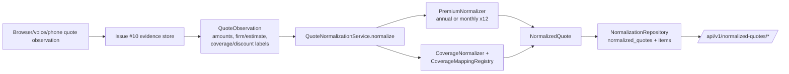

# Issue #11 — Quote Normalization & Coverage Ledger

**Status:** ✅ Implemented (Prompt 1 — core normalization domain + coverage ledger + evidence lineage)

**Depends on:** [Issue #1](./issue-01-foundation.md), [Issue #7](./issue-07-browser-quote-agent.md), [Issue #10](./issue-10-evidence-audit.md)

---

## 0. Prompt 1 at a glance

- **Problem:** providers present quotes in their own wording ("Third party liability -
  $2,000,000", "Comprehensive - $500 deductible", "Annual premium: $1,234.56"). Before
  any comparison/ranking (Issue #12), quotes must be converted into one canonical,
  provider-independent representation — a **normalized quote** with a **coverage ledger** —
  while preserving firm-vs-estimate, keeping every raw label's lineage, and never
  deciding comparability.
- **What was built:**
  - `NormalizedQuote` / `CoverageLedger` / typed `CoverageValue` Pydantic models.
  - A data-driven `CoverageMappingRegistry` (`data/normalization/auto_coverage_mappings.json`,
    `rule_version = "1"`) — config-only alias→canonical mapping, **no fuzzy matching, no
    `if registry_id` branching**.
  - `PremiumNormalizer` (Decimal-only; annual direct, monthly ×12 derived, never fabricates).
  - `CoverageNormalizer` (maps safe labels onto the canonical ledger; unknown stays first-class).
  - `NormalizationRepository` Protocol + in-memory + SQLAlchemy async (`normalized_quotes` +
    `normalized_coverage_items` tables), idempotent on
    `(source_quote_observation_id, normalization_rule_version)`.
  - `QuoteNormalizationService` consuming Issue #10 durable `QuoteObservation` rows
    (raw evidence immutable).
  - Alembic `0002_normalized_quotes` migration (also adds the safe
    `coverage_observations` / `discount_observations` label columns to `quote_observations`).
  - Read-only `/api/v1/normalized-quotes/*` API + deterministic `/normalize` action.
- **Never assigns** `quoted_comparable` / `quoted_non_comparable` (Issue #12 owns those).
- **Tests:** 79 non-gated Issue #11 tests (incl. E2E via the mock quote site) + 1
  Postgres-gated test. Full regression is run before declaring Prompt 1 complete.

---

## 1. What was built and why

The evidence store (Issue #10) persists **raw observations**: amounts (Decimal),
firm-vs-estimate, safe reference handle, and (after the small additive extension in this
issue) the **safe coverage/discount label segments** the browser detector already extracts.
Issue #11 turns those raw observations into a canonical form so that, later, Issue #12
can compare apples to apples.

Why a separate normalization layer and not just a chatbot answer:

- **Comparability needs a canonical substrate.** Comparing "$2,000,000 TPL + $500
  comprehensive deductible" across carriers is meaningless unless every carrier's wording
  maps to the same canonical keys and every premium is in the same annualized currency.
- **Determinism & auditability.** Every mapping decision is data-driven and every
  normalized quote carries its source `QuoteObservation` id + content hash, so an outcome
  can always be traced back to evidence.
- **Separation of concerns.** Normalization only *describes*; it does not rank, recommend,
  or decide comparable/non-comparable. That boundary keeps Issue #12 simple and honest.

Implemented behavior (Prompt 1):

1. **Domain models** (`app/models/normalization.py`): `CoverageItemKey`,
   `CoverageItemState`, `CoverageProvenance`, `NormalizationStatus`, `PremiumDerivation`,
   typed `CoverageValue` (discriminated union: money / boolean / endorsement),
   `CoverageLedgerItem`, `CoverageLedger`, `PremiumNormalized`, `NormalizedQuote`, and
   safe API views (`NormalizedQuoteView`, `NormalizedExportView`, …).
2. **Coverage mapping registry** (`app/services/normalization/config.py` +
   `data/normalization/auto_coverage_mappings.json`): exact (post-normalization) alias →
   canonical key rules, value parsers, currency, annualization rule, `rule_version`.
3. **Money normalization** (`app/services/normalization/money.py`): `PremiumNormalizer`.
4. **Coverage normalization** (`app/services/normalization/coverage.py`): `CoverageNormalizer`
   + deterministic `_parse_amount`.
5. **Persistence** (`app/services/normalization/repository.py`): `NormalizationRepository`
   Protocol, `InMemoryNormalizationRepository`, `SqlAlchemyNormalizationRepository`,
   `NormalizedQuoteORM`, `NormalizedCoverageItemORM`.
6. **Service** (`app/services/normalization/service.py`): `QuoteNormalizationService`,
   content-hash + idempotency-key helpers, API view builders, cached app singleton.
7. **Migration** `migrations/versions/0002_normalized_quotes.py`.
8. **API** (`app/api/normalized_quotes.py`) wired into `app/main.py`.
9. **Issue #10 additive extension**: persist `coverage_observations` /
   `discount_observations` (safe labeled segments) on `QuoteObservation`/evidence models,
   ORM, hashing, ingest builders, migration — the normalization source data.

### Future planned (Prompt 2+)

- Automatic normalization emission via an EvidenceSink-style hook (normalize the moment a
  quote observation lands) — explicitly **not** in Prompt 1.
- Aggregator-vs-direct mapping polish, richer discount/fee capture, and any
  comparability-gated logic — owned by later issues / Issue #12.

---

## 2. Key design decisions

- **Evidence → Normalization dependency direction.** Normalization consumes
  `QuoteObservation` rows and **never mutates them**. Normalized rows are a separate,
  derived projection. This keeps raw evidence the single immutable source of truth.
- **`unknown` is first-class.** `CoverageItemState.UNKNOWN` is distinct from
  `EXCLUDED`. A quote with an unknown component is never treated as "this carrier doesn't
  offer it" and no default/benchmark is silently applied.
- **Partial normalization is allowed.** `NORMALIZED` (premium + ≥1 mapped coverage),
  `PARTIALLY_NORMALIZED` (premium-only or coverage-only), `INSUFFICIENT_EVIDENCE`
  (neither — e.g. a voice quote with no structured amount). A missing component does not
  fail the whole quote.
- **Firm vs estimate preserved.** Estimates are never promoted; both are retained as
  separate rows (no dedup — that's Issue #12's job).
- **Exact matching only.** `_normalize_label` collapses punctuation/case, then the
  registry matches an alias as an **exact leading phrase** of the label ("Third Party
  Liability - $2,000,000" → "third party liability"). The longest matching alias wins.
  Unmatched labels are preserved under `unmapped_coverage` (never guessed, never dropped).
- **No `if registry_id` branching.** Every mapping comes from config. Adding a carrier's
  new wording = a JSON alias + `rule_version` bump, not code.
- **Money is Decimal everywhere.** Monthly ×12 annualization uses `Decimal("12")` and
  quantizes to 0.01. No floats, no currency conversion (hard-CAD scope).
- **Idempotency on `(source_quote_observation_id, normalization_rule_version)`.** Re-running
  `normalize` for the same source+rule returns the same row. Bumping `rule_version`
  deliberately re-normalizes.
- **Content hash mirrors Issue #10 discipline.** Operational fields
  (`content_hash`, `idempotency_key`, `created_at`, `normalized_quote_id`) are excluded;
  datetimes are canonicalized to UTC-naive (see §9 for the SQLite round-trip gotcha).

---

## 3. How data flows

1. A `QuoteObservation` (with `coverage_observations`/`discount_observations`) is read from
   the evidence store via `get_quote_observation(intake_session_id, quote_id)`.
2. `PremiumNormalizer.normalize(annual_premium, monthly_premium, currency)` produces a
   `PremiumNormalized` (`directly_quoted` annual, `derived_annualized` monthly×12, or
   `unknown` when absent).
3. `CoverageNormalizer.normalize(coverage_observations, discount_observations, …)` maps each
   safe label through the registry into `CoverageLedgerItem`s (state, typed value,
   `mapped_alias` provenance, raw labels, source evidence ids) and keeps unmapped labels.
4. `_determine_status` picks the deterministic `NormalizationStatus`.
5. The `NormalizedQuote` is content-hashed and persisted (idempotent). Its
   `source_quote_observation_id` + `source_evidence_record_ids` give full lineage back to
   evidence.
6. Read endpoints return `NormalizedQuoteView` projections (PII-free).

---

## 4. Key files, classes & functions

| File | Key symbols |
|------|-------------|
| `app/models/normalization.py` | `CoverageItemKey`, `CoverageItemState`, `CoverageProvenance`, `NormalizationStatus`, `PremiumDerivation`, `MoneyCoverageValue`/`BooleanCoverageValue`/`EndorsementCoverageValue`, `CoverageValue`, `CoverageLedgerItem`, `CoverageLedger`, `UnmappedCoverageObservation`, `PremiumComponent`, `PremiumNormalized`, `NormalizedQuote`, `NormalizedQuoteView`, `NormalizedExportView` |
| `app/services/normalization/config.py` | `_normalize_label`, `CoverageMappingRule`, `CoverageMappingsFile`, `CoverageMappingRegistry` (`resolve`, `rule_for`), `NormalizationConfigError`, `get_coverage_mapping_registry` |
| `app/services/normalization/money.py` | `PremiumNormalizer` (`normalize`), `MONTHLY_TO_ANNUAL_MULTIPLIER` |
| `app/services/normalization/coverage.py` | `CoverageNormalizer`, `_parse_amount`, `_normalize_state_hint`, `_build_value`, `_endorsement_code` |
| `app/services/normalization/repository.py` | `NormalizationRepository` (Protocol), `InMemoryNormalizationRepository`, `SqlAlchemyNormalizationRepository`, `NormalizedQuoteORM`, `NormalizedCoverageItemORM` |
| `app/services/normalization/service.py` | `QuoteNormalizationService`, `normalized_quote_content_hash`, `normalized_idempotency_key`, `_determine_status`, `_source_channel_from`, view builders, `get_quote_normalization_service` |
| `app/api/normalized_quotes.py` | `POST /normalize`, `GET /{id}`, `/plans/{plan_id}`, `/routes/{planned_route_id}`, `/attempts/{attempt_id}`, `/export` |
| `migrations/versions/0002_normalized_quotes.py` | Adds quote label columns + `normalized_quotes`/`normalized_coverage_items` |
| `data/normalization/auto_coverage_mappings.json` | `rule_version`, `currency`, `annualization`, `value_parsers`, `coverage_mappings` |
| Issue #10 touched files | `app/models/evidence.py`, `app/services/evidence/{persistence,hashing,ingest}.py`, `app/services/evidence/{repository,service}.py` |

---

## 5. Architecture decisions, alternatives & tradeoffs

- **Typed coverage rows vs one-column-per-endorsement.** Storing coverage as rows keyed by
  `CoverageItemKey` keeps the schema stable and extensible (add an enum member + config rule,
  no migration). Tradeoff: the ledger must be reconstructed from rows on read (a small
  deterministic cost).
- **Separate normalized store vs in-place enrichment of evidence.** Normalization is a
  derived projection; keeping it separate preserves evidence immutability and lets us bump
  `rule_version` to re-derive. Tradeoff: two stores to keep consistent — mitigated by
  `source_quote_observation_id` lineage + content hashes.
- **Config-driven mapping registry vs hardcoded alias dict.** Config keeps carrier wording
  changes out of code and makes `rule_version` a real, auditable knob. Tradeoff: a config
  load failure must be loud (`NormalizationConfigError`).
- **Exact leading-phrase matching vs fuzzy/LLM.** Deterministic, testable, no hallucinated
  mappings; unknown labels are preserved rather than guessed. Tradeoff: a novel phrasing
  that isn't a known alias stays unmapped until a config entry is added.
- **One NormalizedQuote per QuoteObservation (no dedup).** Direct + aggregator, estimate +
  firm are all retained. Dedup/ranking/comparability is deliberately out of scope (Issue #12).
- **Status taxonomy without comparable/non-comparable.** `NormalizationStatus` describes
  evidence sufficiency, not market position — keeping the boundary honest.

---

## 6. LangGraph / LangSmith behavior

- Prompt 1 is a **domain service**, not a graph: normalization is deterministic and called
  directly (API action or future sink). No LLM, no LangGraph node.
- Structured logging carries safe metadata only: `workflow=normalization`,
  `workflow_stage=normalize`, `normalization_status`, `rule_version`, `registry_id`,
  `distinct_rate_source_id`, `source_quote_observation_id`, `attempt_id` — **never
  applicant values or raw references**.
- `tests/conftest.py` forces `LANGSMITH_TRACING=false` so the suite stays hermetic; the
  app singleton is `@lru_cache`d and test fixtures clear the evidence + normalization
  caches for isolation.

---

## 7. Privacy / security implications

- Normalized quotes carry **no applicant PII**: no licence, VIN, DOB, address, phone,
  email, claims, or raw quote references. Only safe provider/public wording lives in
  `raw_labels`.
- `coverage_observations`/`discount_observations` are the **safe label segments** already
  produced by the Issue #7 detector (public wording, capped count) — never raw DOM text,
  never private reference handles.
- `source_evidence_record_ids` and `source_quote_observation_id` are opaque ids (safe refs).
- `SensitiveBaseModel` gives redacted repr/`safe_dict`; `extra="forbid"` rejects accidental
  extra fields. Privacy meta-tests assert synthetic sensitive markers never appear in
  normalized quotes, hashes, API views, or exports.

---

## 8. Testing strategy

- **Unit/schema** (`test_normalization_models.py`, `test_normalization_money.py`,
  `test_normalization_coverage.py`): enums never assign comparable statuses; typed-value
  union; Decimal money; premium annualization; alias/label matching; amount parsing;
  unknown-vs-excluded; unmapped preservation; excluded-state hints.
- **Service** (`test_normalization_service.py`): full browser firm quote; idempotency;
  missing-source error; voice insufficient-evidence (never fabricates an amount); monthly
  annualization; estimate-not-promoted; identifier preservation; never-comparable; list by
  plan/route; integrity.
- **Lineage** (`test_normalization_lineage.py`): `source_quote_observation_id` +
  evidence ids; raw evidence immutable; delete scoped to normalization only.
- **Aggregator/dedup** (`test_normalization_aggregator.py`): direct+aggregator and
  estimate+firm both retained (no dedup).
- **Persistence** (`test_normalization_persistence.py`): SQLite round-trip (content-hash
  equality), idempotency, integrity-detects-mutation, Alembic upgrade to head.
- **API** (`test_normalization_api.py`): normalize action, 404, single get, ownership
  boundary, list by plan/route/attempt, export, required query param, idempotent via API.
- **Privacy** (`test_normalization_privacy.py`): sensitive markers absent from model,
  hash, view, export, raw labels.
- **E2E** (`test_normalization_e2e.py`): real mock-site browser flow → automatic evidence →
  normalize → canonical ledger (TPL/accident-benefits/comprehensive/winter-tires).
- **Postgres-gated** (`test_normalization_postgres.py`): `POSTGRES_EVIDENCE_TEST_URL`
  skipif; Alembic head + round-trip + unique idempotency.

Run them: `pytest tests/test_normalization_*.py -q`

---

## 9. Failure scenarios & debugging

- **`NormalizationConfigError`** on registry load (missing/malformed JSON, duplicate alias
  mapping to two keys). Fix the data file; keep `rule_version` semantics in mind.
- **`QuoteNormalizationError`** when a source `QuoteObservation` is missing → API 404.
- **SQLite datetime round-trip:** SQLite returns naive UTC; in-memory objects are aware.
  Strict model equality fails. The content hash uses `mode="python"` + `_canonical`
  (UTC-naive) so hashes match across the round trip — compare by hash, not `==`.
- **Alembic `asyncio.run()` inside an async test:** `env.py` calls `asyncio.run`, so
  migration tests must be **sync** `def` (like the Issue #10 evidence ones) and wrap the
  async verification in their own `asyncio.run`.
- **API singleton statefulness:** `get_quote_normalization_service` is `lru_cache`d so
  POST-then-GET share one repository; tests clear both caches in an autouse fixture.
- **PowerShell escaping:** `$` in inline `-c` scripts gets eaten by PowerShell — use labels
  without `$` or heredocs in ad-hoc checks.

---

## 10. Common misunderstandings

- "Unknown coverage = not offered." **No** — `unknown` is first-class and never collapsed
  into `excluded`/`not_offered`.
- "Normalization decides which quote is better." **No** — it only canonicalizes. Ranking and
  `quoted_comparable`/`quoted_non_comparable` are Issue #12.
- "Fuzzy/LLM matching maps odd labels." **No** — exact phrase matching; unmapped labels are
  preserved, not guessed.
- "Voice quotes must get a premium somehow." **No** — voice quotes without a structured
  amount are `insufficient_evidence`; no amount is fabricated and no STT/LLM is used.

---

## 11. Interview explanation

> "Each carrier writes coverage its own way, so before comparing anything we normalize
> every quote into one canonical representation. The browser (Issue #7) already captures
> safe coverage labels; the evidence store (Issue #10) persists them durably. Issue #11
> reads those observations and builds a `NormalizedQuote`: a `PremiumNormalized` (annual,
> or monthly annualized ×12, Decimal-only) plus a `CoverageLedger` whose items map provider
> wording onto canonical keys via a data-driven registry — exact phrase matching, never
> fuzzy, never per-carrier code. Unknown coverage stays unknown, estimates stay estimates,
> and every row keeps its source quote observation id and a content hash so we can audit
> exactly where each value came from. It's deterministic and idempotent — re-normalizing
> the same source with the same rule version returns the same row. It deliberately never
> ranks or says comparable; that's Issue #12."

---

## 12. Self-test questions

1. Where does a normalized quote get its source amounts/coverage from, and what guarantees
   raw evidence isn't mutated? (*Answer:* `source_quote_observation_id` from the Issue #10
   `QuoteObservation`; normalization only reads evidence and writes to the normalization
   store.)
2. What does `unknown` mean and why is it distinct from `excluded`?
3. How is a monthly premium annualized, and what derivation rule records it?
4. Why is idempotency keyed on `(source_quote_observation_id, normalization_rule_version)`?
5. Name the three statuses and when each applies. Which two statuses must never be assigned
   here, and why?
6. How are coverage labels matched without fuzzy matching or `if registry_id` branching?
7. What happens to a label the registry doesn't know?
8. Why does the SQLite round-trip compare by content hash instead of `==`?
9. Why must the Alembic migration tests be sync functions?

*(Answers are in §2, §3, §5, §9.)*

---

## 13. Rebuild exercise

1. Build `NormalizedQuote` + `CoverageLedger` Pydantic models with typed `CoverageValue`.
2. Write `auto_coverage_mappings.json` (rule_version, aliases → canonical keys, value types).
3. Implement `CoverageMappingRegistry` with exact leading-phrase matching.
4. Implement `PremiumNormalizer` (annual / monthly×12 / unknown) and `CoverageNormalizer`.
5. Implement `NormalizationRepository` (in-memory + SQLAlchemy) and
   `QuoteNormalizationService.normalize` with idempotency + content hash.
6. Add migration 0002 and a read-only API with safe views.
7. Extend Issue #10 evidence to persist the safe label segments; wire `get_quote_observation`.
8. Test: schema, money, coverage, service, lineage, aggregator, persistence, API, privacy,
   E2E (mock site), Postgres-gated.

---

## 14. Cheat sheet

- `normalize(intake_session_id, source_quote_observation_id)` → `NormalizedQuote` (idempotent).
- Status: `normalized` | `partially_normalized` | `insufficient_evidence` | `invalid_source`.
- Ledger item: `item_key` + `state` (included/excluded/unknown/…) + typed `value` + `provenance`.
- Money: `PremiumNormalized.provider_presented_amount/frequency`, `normalized_annual_amount`,
  `annualized`, `derivation` (`directly_quoted`/`derived_annualized`).
- Config: `data/normalization/auto_coverage_mappings.json`; `NORMALIZATION_DATA_DIR` override.
- API: `POST /api/v1/normalized-quotes/normalize`, `GET .../plans/{id}`, `/routes/{id}`,
  `/attempts/{id}`, `/{id}`, `/export` — all `intake_session_id`-scoped.
- Tables: `normalized_quotes`, `normalized_coverage_items` (FK, `ondelete=CASCADE`).

---

## 15. Prompt 2 deep-dive (placeholder)

Prompt 2 will add automatic normalization emission, deeper aggregator/discount handling,
and any comparability-gating — finalized when Prompt 2 is implemented.
