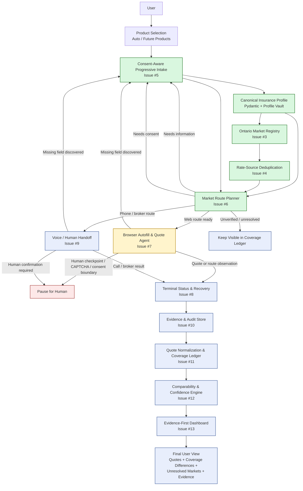
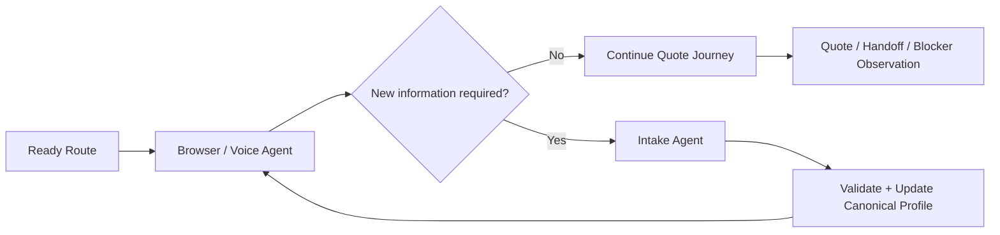
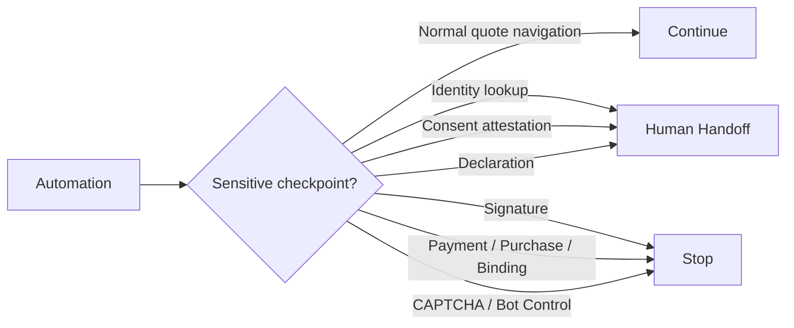

# Ontario All-Quote Agent — Architecture Flow

## What is completed

- **Issue #1:** Foundation, FastAPI, LangGraph, LangSmith, logging and redaction
- **Issue #2:** Canonical auto-insurance schema
- **Issue #3:** Progressive profiles and Ontario market registry
- **Issue #4:** Rate-source deduplication
- **Issue #5:** Consent-aware progressive intake
- **Issue #6:** Product-aware market route planner

## Currently being built

- **Issue #7:** Browser Autofill & Quote Agent using Playwright

## Planned next

- **Issue #8:** Terminal status and recovery
- **Issue #9:** Voice / broker handoff
- **Issue #10:** Evidence and audit
- **Issue #11:** Quote normalization
- **Issue #12:** Comparability and confidence
- **Issue #13:** Evidence-first dashboard

## Core design principle

The system does not simply visit a list of insurance websites.

It first:

1. builds one canonical applicant profile,
2. understands the Ontario insurance market,
3. avoids counting confirmed duplicate rate sources twice,
4. determines readiness independently for each route,
5. asks the user only when genuinely new information is required,
6. preserves consent and human checkpoints,
7. then executes web or voice routes,
8. and finally presents quotes with evidence and honest market coverage.

## Key runtime loop

## Safety boundaries

